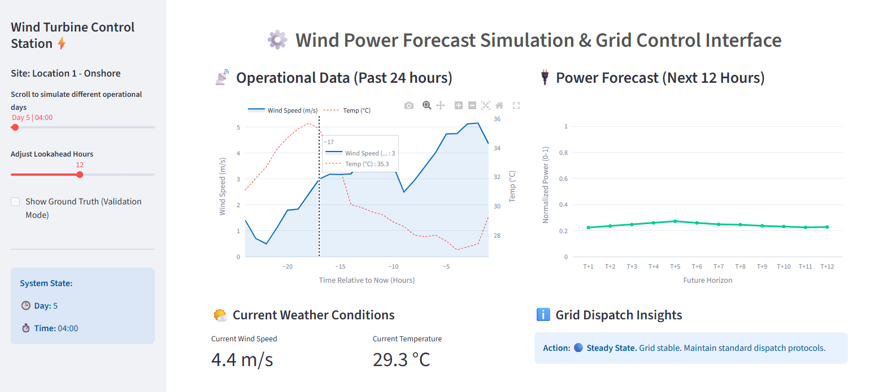
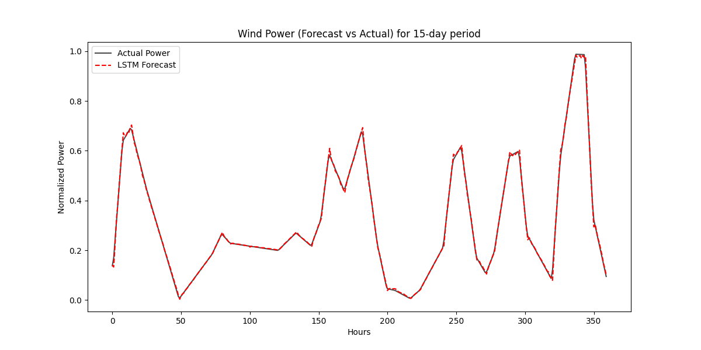
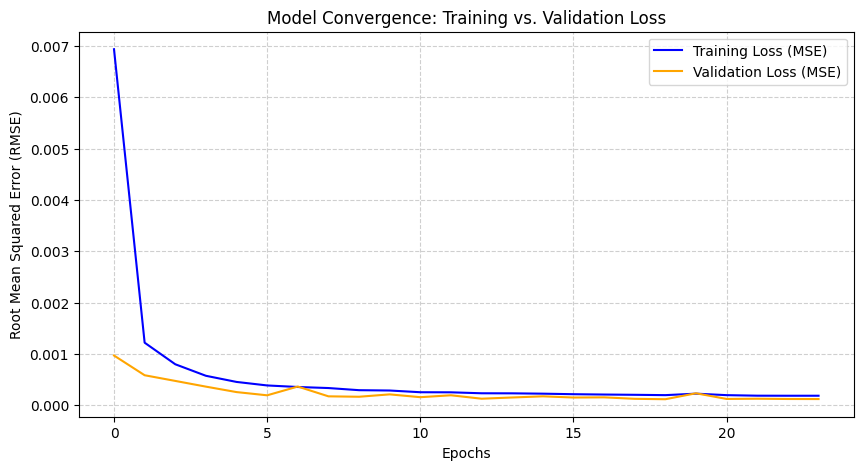

# Short-Term Wind Power Forecasting using LSTM Networks For Grid Control

[Open the Live Wind Power Forecasting App⚡]()

<p align="center">

</p>

This project implements a predictive modelling framework for wind energy grid integration. Utilizing a layered **Long Short-Term Memory (LSTM)** neural network, the system models the non-linear relationship between weather data and power output. The model achieves an **R² Score of 0.9989** and an **RMSE of 0.0099**, providing grid operators with a high-fidelity Digital Twin for real-time frequency regulation and ramp event management.

## 📌 Project Overview

Wind energy intermittency presents a significant challenge for grid stability. Sudden changes in wind speed (ramp events) can lead to frequency deviations if backup generation is not dispatched in time.

This project addresses this by developing a robust forecasting engine that analyzes weather data and historical power output to forecast future wind turbine power generation.

## 🛠️ Technology Used

* **Deep Learning:** TensorFlow/Keras
* **Web Framework:** Streamlit (Real-time Dashboard)
* **Data Science:** Pandas, NumPy, Scikit-learn
* **Visualization:** Plotly (Interactive Graphs), Matplotlib (Analysis)
* **Dataset:** [Kaggle Wind Power Generation Data](https://www.kaggle.com/datasets/mubashirrahim/wind-power-generation-data-forecasting)

## 🔳 Key Features

* **Stacked LSTM Architecture:** Features 64 Encoder units and 32 Decoder units with Dropout regularization (0.2) to capture complex temporal dependencies.
* **Automated Training Supervision:** Implements `EarlyStopping` with weight restoration to ensure the model generalizes effectively without overfitting.
* **Interactive Simulation Slider:** A custom Streamlit control station that allows users to scroll through Operational Days and adjust Lookahead Horizons.
* **Grid Dispatch Insights:** An automated logic engine that provides operational alerts (e.g., "Pre-charge battery storage") based on forecast volatility and average power output.

## 📁 Repository Structure

<pre>
├── data
│   └── Location1.csv
├── model_assets
│   ├── feature_cols.pkl
│   ├── scaler.gz
│   ├── test_data.csv
│   └── wind_lstm_model.keras
├── model_training
│   ├── wind_power_forecasting_lstm.ipynb
├── results
│   ├── dashboard_preview.png
│   ├── forecast_vs_actual.png
│   ├── model_convergence.png
│   ├── power_curve.png
│   └── wind_speed_comparison.png
├── streamlit_app
│   ├── wind_power_pred.py
├── LICENSE
├── README.md
└── requirements.txt
</pre>

## 🚀 Getting Started

### 1. Clone the Repository

```bash
git clone https://github.com/Oluwatobi-coder/Wind-Power-Forecasting-LSTM.git
cd Wind-Power-Forecasting-LSTM

```

### 2. Install Dependencies

```bash
pip install -r requirements.txt

```

### 3. Run the App

```bash
streamlit run ./streamlit_app/wind_power_pred.py

```

## 📊 Results

The LSTM model demonstrated near-perfect alignment with simulated ground-truth data, successfully identifying both daily cycles and random wind gusts.

<p align="center">

</p>

<p align="center">

</p>


| Metric | Test Set Performance |
| --- | --- |
| **Root Mean Square Error (RMSE)** | 0.0099 |
| **Mean Absolute Error (MAE)** | 0.0061 |
| **R² Score** | 0.9989 |

### Performance Visualizations


## 🤝 Contributing

Contributions are welcome! Potential improvements include:

* Adding Multi-Site forecasting (Offshore vs. Onshore).
* Implementing a PID controller simulation for blade pitch control based on the forecast.


## 📚 References

* Hochreiter, S., & Schmidhuber, J. (1997). Long Short-Term Memory. Neural Computation, 9(8), 1735–1780. 10.1162/neco.1997.9.8.1735.
* Rahim, M. (2021). Wind Power Generation Data Forecasting. Kaggle. Available at: https://www.kaggle.com/datasets/mubashirrahim/wind-power-generation-data-forecasting


## 📜 License

This project is licensed under the MIT License - see the `LICENSE` file for details.

If you find this predictive model framework useful, please ⭐ the repository!
